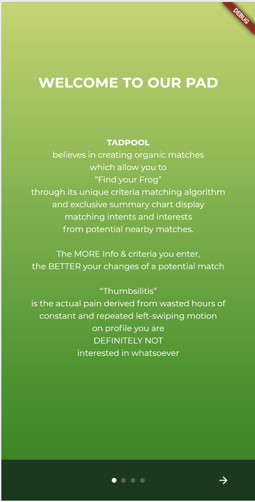
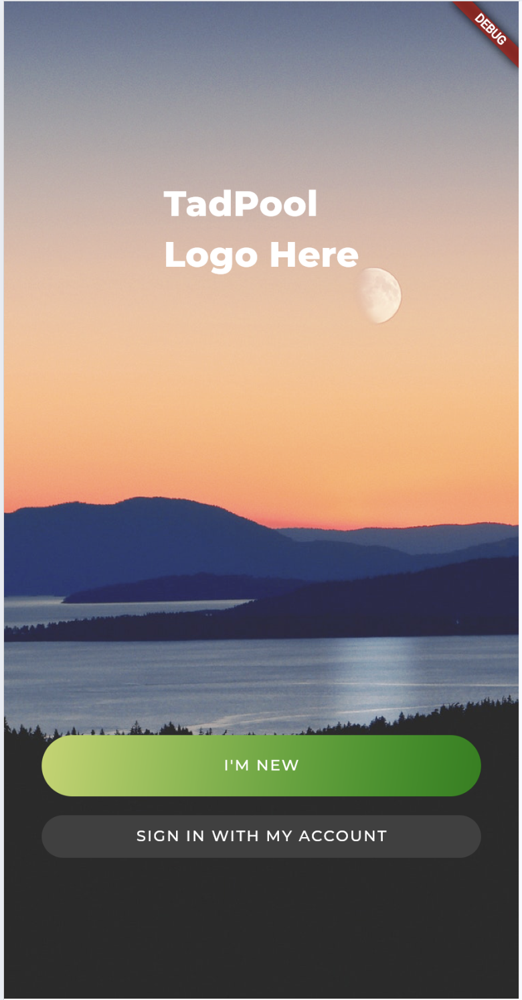
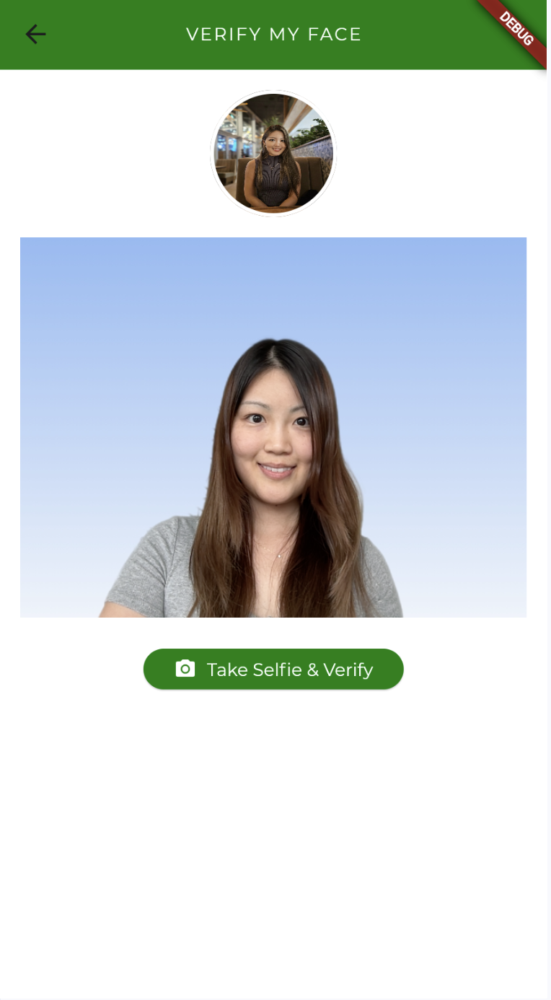
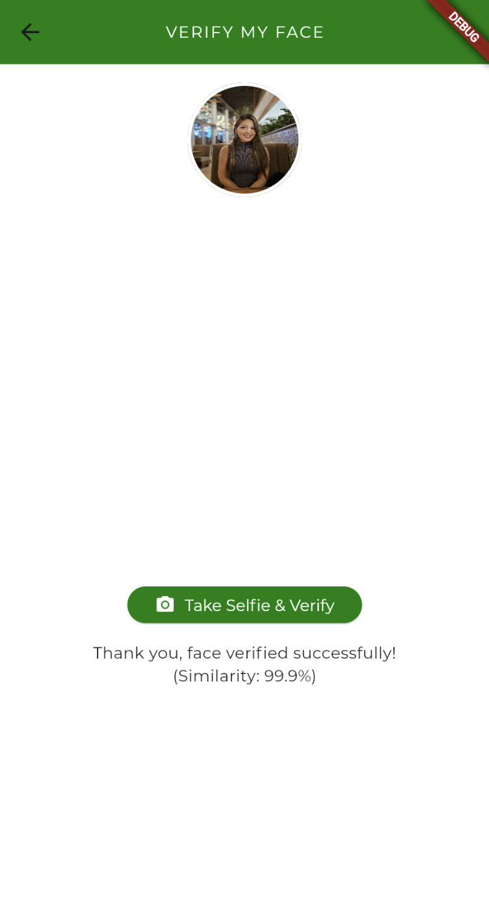
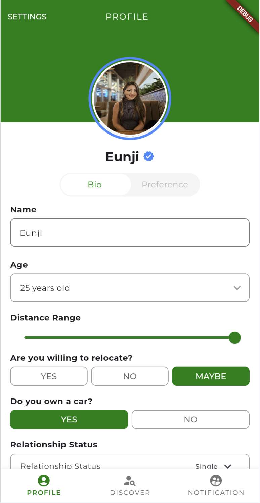
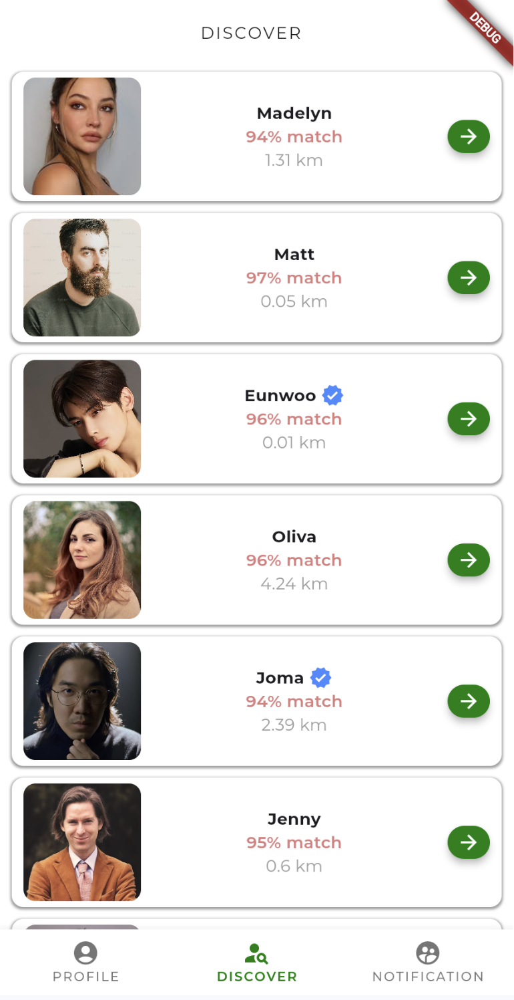
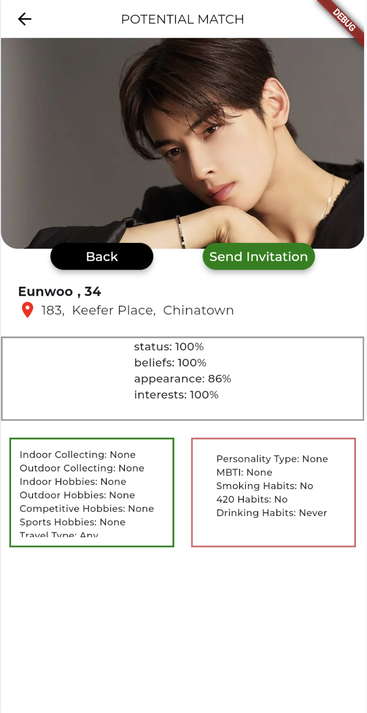
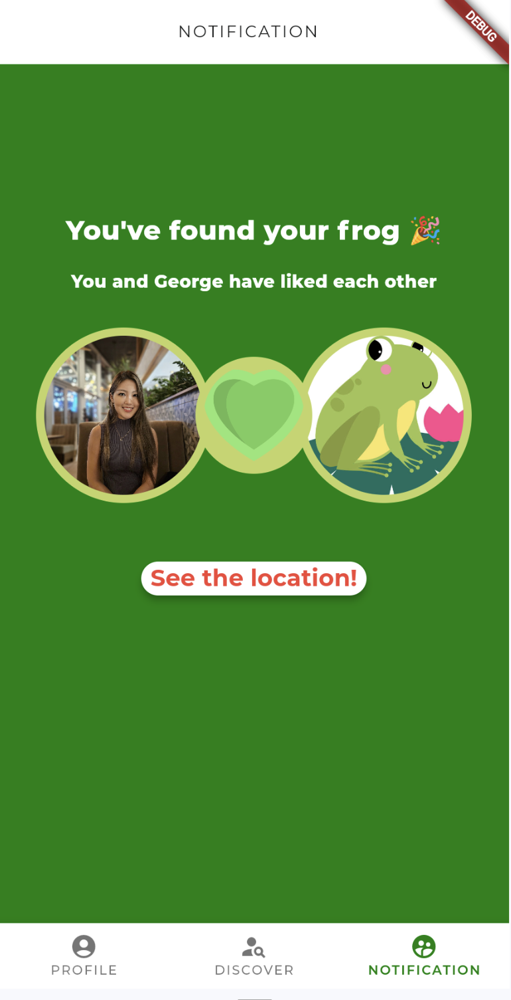
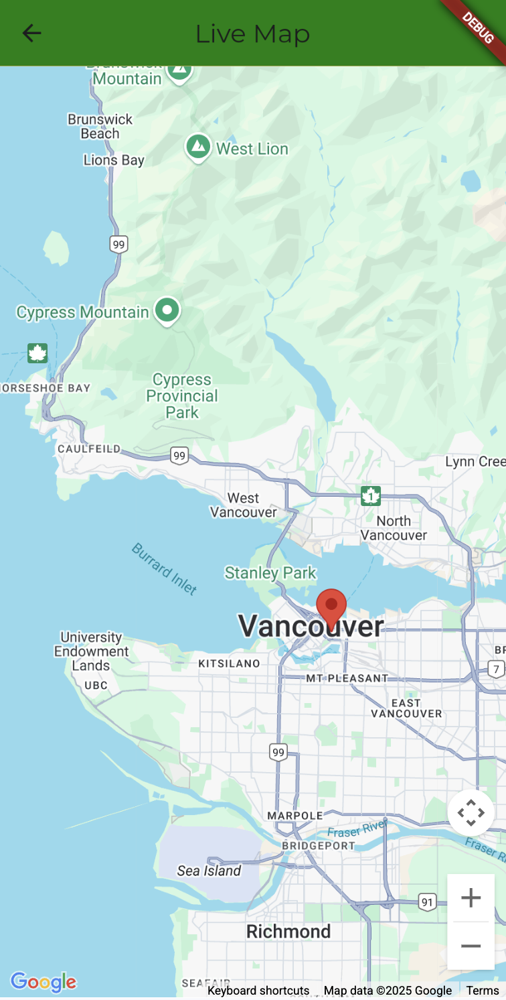
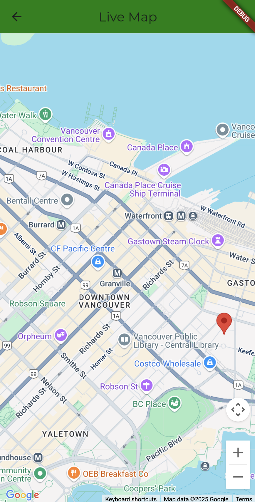

## 📱 TadPool – A Real-World Dating App for Safe, Verified Connections

TadPool is a mobile dating and networking app built to solve common online dating problems — ghosting, fake profiles, and unsafe meetups — by focusing on **verified, location-based matches** that encourage **real-life connections**.

  

---

## 🚀 Project Overview

- 🗓️ **Timeline:** 4-week sprint (April 28 – May 21, 2025)  
- 👥 **Team:** 5 developers for BCIT's COMP 3800 Capstone  
- 🧠 **Scope:** Inherited and refactored a legacy codebase from multiple past teams  
- 📂 **This Repo:** Contains **only the files I personally worked on**, extracted from the private team repo

---

## ✨ Key Features (Team-wide)

- 🧠 **Facial Verification with AWS Rekognition**  
  Users verify their identity by taking a selfie after creating the profile.

- 🗺️ **Real-Time Map Integration**  
  Track user location and enable proximity-based match invites.

- 🔔 **In-App Notification System**  
  All interactions (date invites, responses) are handled through custom push notifications.

---

## 🛠 Tech Stack

- **Frontend:** Flutter  
- **Backend:** Django + PostgreSQL  
- **Cloud Services:** AWS S3, AWS Rekognition, Firebase Cloud Messaging  
- **DevOps:** Docker, EC2, GitHub, Jira

---

## 👩‍💻 My Contributions

I worked across both the frontend and backend, focusing on:

- 📸 Building the full image upload flow: from Flutter → Django API → AWS S3
- 🧠 Integrating AWS Rekognition for selfie-based facial verification
- 🐳 Dockerizing the backend and deploying services to EC2 via Docker Compose
- 🔑 Refactoring Django’s auth system to support email login with a custom `EmailBackend`
- 🧼 Modernizing legacy code by upgrading dependencies and reorganizing the structure

---

## 🖼️ Screenshots

# 🔐 Login & Onboarding

# 🧠 Facial Verification

# 🤝 Matching Flow

#📍 Map Features

---

## 🔧 How to Run (Partial Setup)

> Due to the private nature of the full repo and secrets, this public repo is not fully runnable.  
> However, key files (APIs, logic, components) are included for portfolio purposes.

---

## 💡 Why This Repo Exists

The original project was hosted in a **private group repository**.  
This repo is a curated version that includes **only the files I directly worked on**, recreated for public viewing.

---

## 📝 License / Disclosure

This repo is for **educational and portfolio purposes only.**  
Original full repo access is restricted to the team.

---
